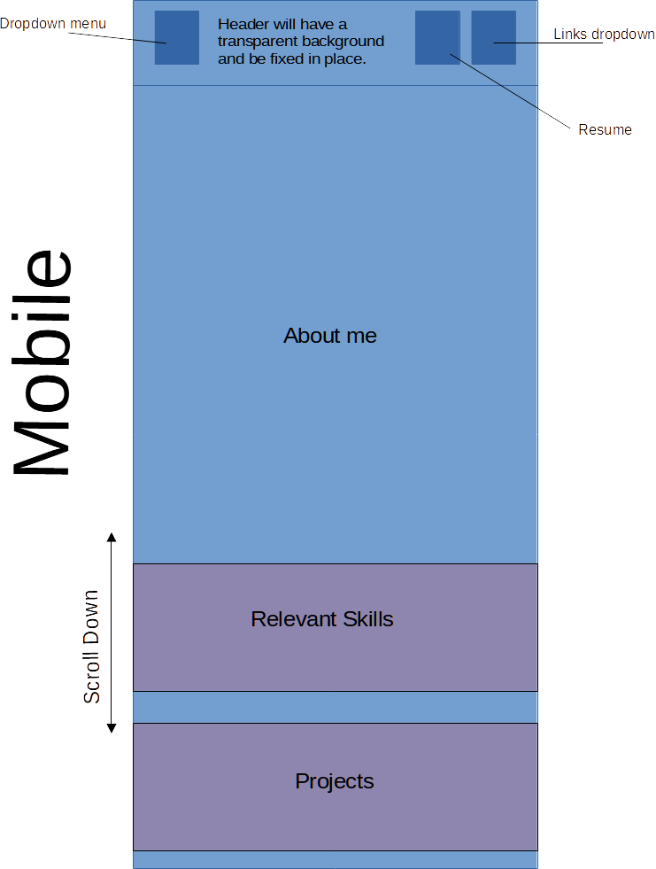
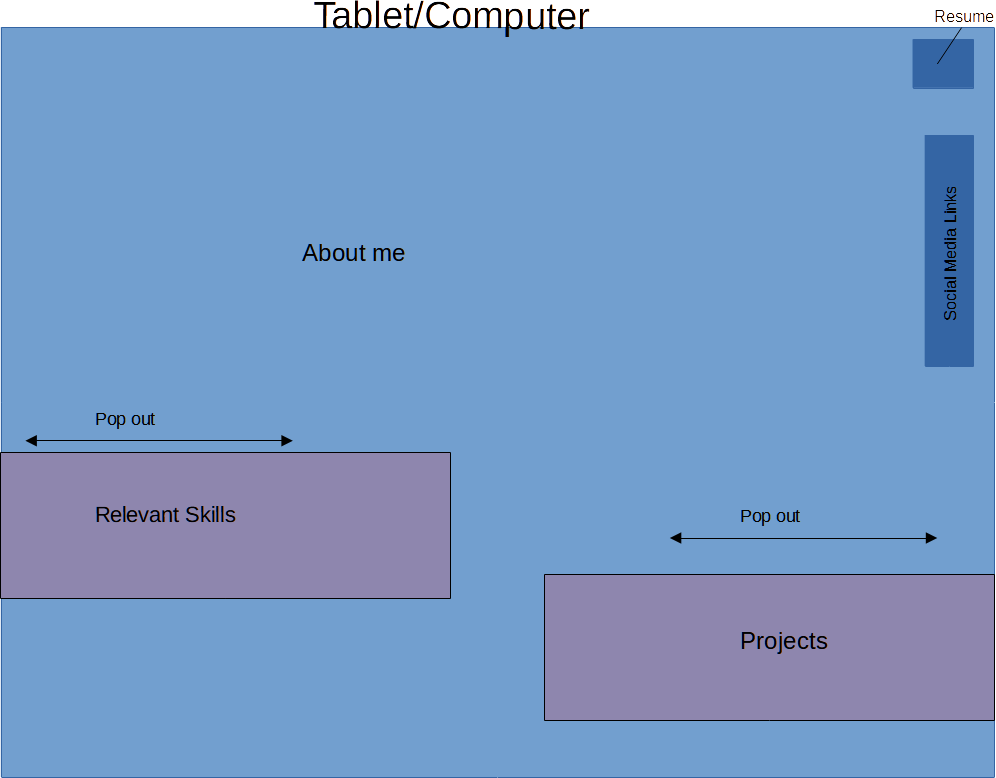

# Project Overview

### Project Schedule
---------------------

| Day   | Deliverable 	                               | Status      |
| ----- | -------------------------------------------- | ------------|
| Day 1 | Project Description 	                       | Complete    |
| Day 1 | Wireframes / Priority Matrix / Timeline      | Complete    |
| Day 3 | Core Application Structure (HTML, CSS, etc.) | Working     |
| Day 4 | MVP & Bug Fixes                              | Incomplete  |
| Day 5 | Final Touches 	                           | Incomplete  |
| Day 6 | Present 	                                   | Incomplete  |

---------------------------
---------------------------

### Project Description
---------------------

I'd like to make a one page website that the user doesn't have to move from.  The full version will have buttons with panels that pop out with all of the different ellements of the webpage [(Steel-CSS Zen Garden](http://csszengarden.com/219/)).  The mobile version will need to be even more simply designed.  It will either have a dropdown menu with the options that open in the current page, or it may need to have the user scroll to the different headings.  I will need to work with this to find out which will work for the project.  I would like a simple and somewhat cartoony design with few colors in both versions ([Matt Farley Portfolio](https://mattfarley.ca/)).  It will be mostly greyscale with one color for accent.  I would also like to look into using multiple background images to give a layered depth ([Steel-CSS Zen Garden](http://csszengarden.com/219/)).

#### Elements to include

* Who I am - About me
* Relevant Skills
    * html5
    * css
    * javaScript
    * jQuery

* Projects
* Links - Linked in, Github, Twitter, Email
    * LinkedIn
    * Github
    * Twitter
    * E-mail
* Resume button

#### Requirements
* HTML and CSS using best practices
* Grid and Flexbox
* Mobile first and then tablet and desktop responsive
* Must implement javascript to extend functionality, use at least 1 of the following.
    * AJAX
    * Animations
    * Javascript Logic
    * jQuery interations
* Be deployed and accessible online via Github

#### Inspiring Developer Portfolios

* [Bruno Simon](https://bruno-simon.com/)
* [Denise Chandler](https://denisechandler.com/)
* [Brittany Chiang](https://brittanychiang.com/)
* [Robb Owen](https://robbowen.digital/)

### Wireframes
---------------------

### Time/Priority Matrix
---------------------

* Responsive page for mobile
* Page for tablet and computer
* Who am I
* Work history relevant points
* relevant Skills
* Projects
* Links
* css
* javascript

### MVP/PostMVP
---------------------

##### MVP

* Responsive page for mobile
* Page for tablet and computer
* Who am I
* Work history relevant points
* relevant Skills
* Projects
* Links
* css
* javascript
* jquery popouts

##### Post-MVP

* additional css

### Functional Components
---------------------

##### MVP

| Component          | Priority | Estimated Time | Actual Time |
| ------------------ | -------- | ---------------| ----------- |
| Html -writing divs |     H    |        2hrs    |             |
| header             |     H    |        30 min  |             |
| Hamburger menu     |     H    |        1 hr    |             |
| links              |     H    |        1 hr    |             |
| Grid layout        |     H    |        1 hr    |             |
| jquery popouts     |     M    |        2 hrs   |             |
| Basic css          |     H    |        1 hr    |             |
|                    |          |                |             |
|                    |          |                |             |

##### Post-MVP

| Component       | Priority | Estimated Time | Actual Time |
| --------------- | -------- | ---------------| ----------- |
|additional css   |    L     |       2 hrs    |             |
|                 |          |                |             |
|                 |          |                |             |
|                 |          |                |             |
|                 |          |                |             |
|                 |          |                |             |

### Additional Libraries
---------------------

### Code Snippet
--------------------- 

### Issues and Resolutions
---------------------

